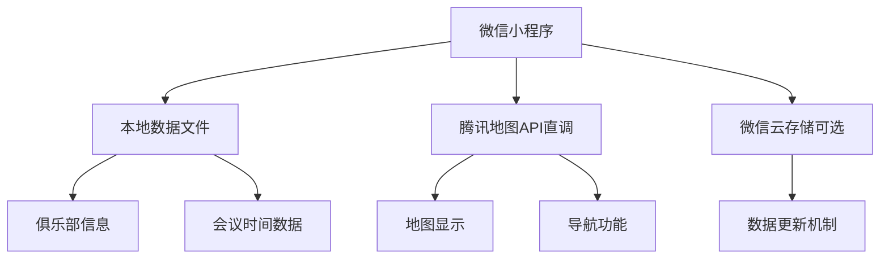

# TMC Map 前端独立架构方案

## 🎯 架构概述

将整个TMC地图小程序改为纯前端架构，无需后端服务器，大幅降低成本和维护复杂度。

## 🏗️ 新架构设计



## 📊 数据存储方案

### 方案1: 静态数据文件（推荐）
```javascript
// data/clubs.js
export const clubsData = [
  {
    id: 1,
    name: "深圳四合院国际演讲俱乐部",
    shortName: "四合院TMC",
    address: "深圳市福田区莲花西第一世界广场大厦18A四合院",
    lat: 22.5431,
    lng: 114.0579,
    city: "深圳",
    meetingTime: "周一 19:30-21:30 双语",
    weekday: 1,
    contact: "Sherry YANG",
    phone: "13603014039",
    features: "交通便利,环境优雅",
    description: "位于福田中心区，交通便利"
  },
  // ... 更多俱乐部数据
]
```

### 方案2: 云端数据文件
```javascript
// 使用CDN托管JSON文件
const CLUBS_DATA_URL = 'https://your-cdn.com/clubs.json'

// 小程序启动时加载
async loadClubsData() {
  try {
    const res = await uni.request({
      url: CLUBS_DATA_URL,
      method: 'GET'
    })
    this.clubsData = res.data
  } catch (error) {
    // 使用本地备份数据
    this.clubsData = require('./data/clubs.js').clubsData
  }
}
```

### 方案3: 微信云存储（高级选项）
```javascript
// 使用微信小程序云开发
wx.cloud.database().collection('clubs').get().then(res => {
  this.clubsData = res.data
})
```

## 🗂️ 新的目录结构

```
uniapp-tmc-map/
├── src/
│   ├── data/
│   │   ├── clubs.js          # 俱乐部静态数据
│   │   ├── cities.js         # 城市列表
│   │   └── constants.js      # 常量配置
│   ├── utils/
│   │   ├── mapUtils.js       # 地图工具函数
│   │   ├── dataFilter.js     # 数据筛选逻辑
│   │   └── storage.js        # 本地存储管理
│   ├── services/
│   │   └── mapApi.js         # 腾讯地图API调用
│   └── components/
│       ├── MapView.vue       # 地图组件
│       ├── ClubList.vue      # 俱乐部列表
│       └── FilterPanel.vue   # 筛选面板
```

## 💡 核心功能实现

### 1. 数据筛选（客户端）
```javascript
// utils/dataFilter.js
export class DataFilter {
  static filterByWeekday(clubs, weekday) {
    if (!weekday) return clubs
    return clubs.filter(club => club.weekday === weekday)
  }
  
  static filterByCity(clubs, city) {
    if (!city) return clubs
    return clubs.filter(club => club.city === city)
  }
  
  static filterByDistance(clubs, userLocation, maxDistance) {
    return clubs.filter(club => {
      const distance = this.calculateDistance(
        userLocation.lat, userLocation.lng,
        club.lat, club.lng
      )
      return distance <= maxDistance
    })
  }
  
  static calculateDistance(lat1, lng1, lat2, lng2) {
    // 计算两点间距离
    const R = 6371 // 地球半径
    const dLat = (lat2 - lat1) * Math.PI / 180
    const dLng = (lng2 - lng1) * Math.PI / 180
    const a = Math.sin(dLat/2) * Math.sin(dLat/2) +
              Math.cos(lat1 * Math.PI / 180) * Math.cos(lat2 * Math.PI / 180) *
              Math.sin(dLng/2) * Math.sin(dLng/2)
    const c = 2 * Math.atan2(Math.sqrt(a), Math.sqrt(1-a))
    return R * c
  }
}
```

### 2. 地图API直调
```javascript
// services/mapApi.js
export class MapService {
  constructor() {
    this.apiKey = 'YOUR_TENCENT_MAP_API_KEY'
    this.baseUrl = 'https://apis.map.qq.com'
  }
  
  // 路线规划
  async getRoutes(fromLat, fromLng, toLat, toLng, mode = 'driving') {
    const url = `${this.baseUrl}/ws/direction/v1/${mode}`
    const params = {
      from: `${fromLat},${fromLng}`,
      to: `${toLat},${toLng}`,
      key: this.apiKey
    }
    
    try {
      const res = await uni.request({
        url,
        data: params,
        method: 'GET'
      })
      return res.data
    } catch (error) {
      console.error('路线规划失败:', error)
      // 降级到调用系统地图
      this.openSystemMap(toLat, toLng)
    }
  }
  
  // 调用系统地图应用
  openSystemMap(lat, lng, name) {
    uni.openLocation({
      latitude: lat,
      longitude: lng,
      name: name,
      scale: 15
    })
  }
}
```

### 3. 数据更新机制
```javascript
// utils/dataUpdater.js
export class DataUpdater {
  static async checkForUpdates() {
    try {
      // 检查版本号
      const versionRes = await uni.request({
        url: 'https://your-cdn.com/version.json',
        method: 'GET'
      })
      
      const localVersion = uni.getStorageSync('dataVersion') || '1.0.0'
      const remoteVersion = versionRes.data.version
      
      if (this.compareVersions(remoteVersion, localVersion) > 0) {
        return await this.downloadUpdate()
      }
      
      return false
    } catch (error) {
      console.log('更新检查失败，使用本地数据')
      return false
    }
  }
  
  static async downloadUpdate() {
    try {
      const dataRes = await uni.request({
        url: 'https://your-cdn.com/clubs.json',
        method: 'GET'
      })
      
      // 保存到本地存储
      uni.setStorageSync('clubsData', dataRes.data)
      uni.setStorageSync('dataVersion', dataRes.data.version)
      
      return true
    } catch (error) {
      console.error('数据更新失败:', error)
      return false
    }
  }
}
```

## 🎨 主要页面改造

### 1. 首页地图页面
```vue
<template>
  <view class="map-container">
    <map
      id="tmc-map"
      :latitude="centerLat"
      :longitude="centerLng"
      :scale="scale"
      :markers="filteredMarkers"
      @markertap="onMarkerTap"
      @tap="onMapTap"
    >
    </map>
    
    <filter-panel 
      @filter-change="onFilterChange"
      :cities="availableCities"
    />
  </view>
</template>

<script>
import { clubsData } from '@/data/clubs.js'
import { DataFilter } from '@/utils/dataFilter.js'
import { MapService } from '@/services/mapApi.js'

export default {
  data() {
    return {
      clubsData: clubsData,
      filteredClubs: clubsData,
      centerLat: 39.908823,
      centerLng: 116.397470,
      scale: 10,
      currentFilters: {}
    }
  },
  
  computed: {
    filteredMarkers() {
      return this.filteredClubs.map(club => ({
        id: club.id,
        latitude: club.lat,
        longitude: club.lng,
        iconPath: '/static/images/club-marker.png',
        callout: {
          content: club.shortName,
          color: '#ffffff',
          fontSize: 12,
          borderRadius: 8,
          bgColor: '#1976D2',
          padding: 4,
          display: 'BYCLICK'
        }
      }))
    },
    
    availableCities() {
      return [...new Set(this.clubsData.map(club => club.city))]
    }
  },
  
  methods: {
    onFilterChange(filters) {
      this.currentFilters = filters
      this.applyFilters()
    },
    
    applyFilters() {
      let filtered = this.clubsData
      
      if (this.currentFilters.city) {
        filtered = DataFilter.filterByCity(filtered, this.currentFilters.city)
      }
      
      if (this.currentFilters.weekday) {
        filtered = DataFilter.filterByWeekday(filtered, this.currentFilters.weekday)
      }
      
      this.filteredClubs = filtered
    },
    
    onMarkerTap(e) {
      const markerId = e.detail.markerId
      const club = this.clubsData.find(c => c.id === markerId)
      if (club) {
        uni.navigateTo({
          url: `/pages/club-detail/club-detail?id=${club.id}`
        })
      }
    }
  },
  
  onLoad() {
    this.getCurrentLocation()
  }
}
</script>
```

## 💰 成本对比

### 原架构成本
- 云服务器: ¥80-120/月
- 数据库: ¥50/月 
- 域名SSL: ¥10/月
- **总计: ¥140-180/月**

### 新架构成本
- 微信小程序: ¥25/月
- 腾讯地图API: ¥0-30/月（大部分免费）
- CDN托管(可选): ¥5/月
- **总计: ¥25-60/月**

**节省成本: 60-75%**

## ✅ 优势分析

### 1. 成本优势
- 无服务器费用
- 无数据库费用
- 无运维成本
- 只需小程序费用

### 2. 性能优势
- 数据本地化，加载更快
- 减少网络请求
- 离线可用（基础功能）

### 3. 维护优势
- 无服务器维护
- 无数据库管理
- 部署更简单
- 更新只需发布小程序

### 4. 开发优势
- 开发流程简化
- 测试更容易
- 版本控制统一

## ⚠️ 注意事项

### 1. 数据更新机制
- 俱乐部信息变更需要发布新版本
- 或使用CDN+本地存储方案

### 2. API安全
- 地图API密钥暴露在前端
- 需要设置域名白名单和调用量限制

### 3. 功能限制
- 无用户系统（如不需要）
- 无复杂数据分析（如不需要）

### 4. 扩展性
- 功能复杂化时可能需要后端

## 🚀 实施建议

1. **第一阶段**: 保持现有数据结构，改为静态数据
2. **第二阶段**: 优化数据加载和筛选逻辑
3. **第三阶段**: 添加数据更新机制（如需要）

对于TMC俱乐部地图这样的项目，**前端独立架构是完全可行的**，且能大幅降低成本和复杂度！ 