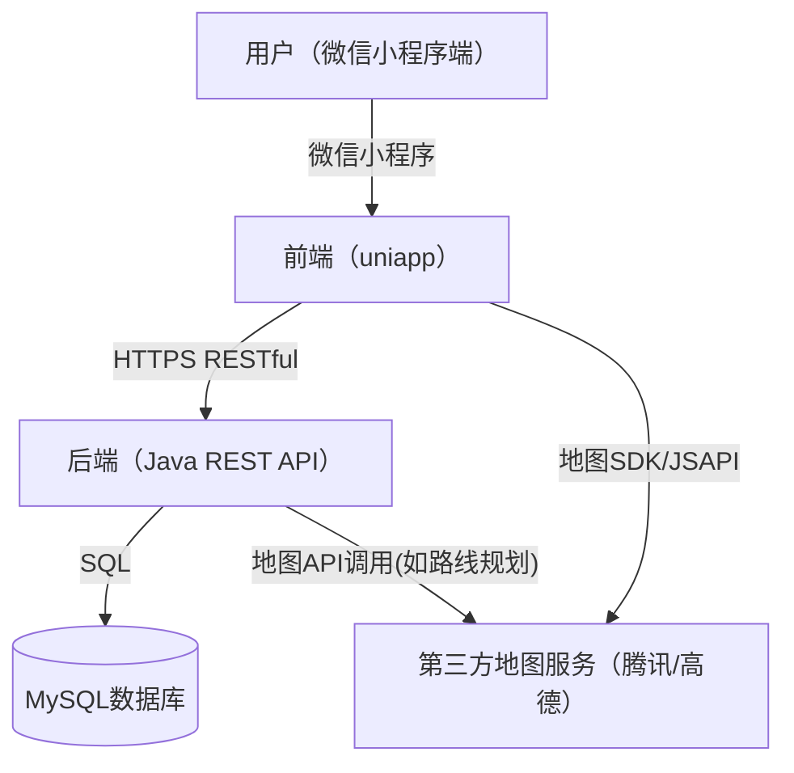

# 头马俱乐部地图小程序整体架构设计文档

## 1. 系统架构图



## 2. 前端项目设计（uniapp）

### 2.1 目录结构

```
uniapp-tmc-map/
├── pages/                # 页面目录
│   ├── index/            # 首页（地图页）
│   ├── club-detail/      # 俱乐部详情页
│   ├── navigation/       # 导航页面
│   └── ...
├── components/           # 公共组件
│   ├── MapView.vue       # 地图组件
│   ├── ClubCard.vue      # 俱乐部信息卡片
│   ├── DatePicker.vue    # 日期选择器
│   └── ...
├── store/                # 状态管理（如pinia）
├── utils/                # 工具函数
├── services/             # API请求封装
│   └── club.js           # 俱乐部相关API
├── static/               # 静态资源
├── App.vue               # 应用入口
├── main.js               # 入口JS
└── manifest.json         # 小程序配置
```

### 2.2 主要模块说明
- pages/index/：地图展示、筛选、信息卡片弹窗
- pages/club-detail/：俱乐部详细信息展示
- pages/navigation/：路线规划与导航信息
- components/：地图、卡片、日期选择等可复用组件
- services/：统一管理与后端的API交互
- store/：全局状态管理（如用户定位、筛选条件等）

## 3. 后端项目设计（Java）

### 3.1 目录结构

```
tmc-map-backend/
├── src/
│   ├── main/
│   │   ├── java/com/tmcmap/
│   │   │   ├── controller/    # 控制器层，REST接口
│   │   │   ├── service/       # 业务逻辑层
│   │   │   ├── service/impl/  # 业务实现
│   │   │   ├── model/         # 实体与DTO
│   │   │   ├── repository/    # 数据访问层
│   │   │   ├── config/        # 配置类
│   │   │   └── util/          # 工具类
│   │   └── resources/
│   │       ├── application.yml # 配置文件
│   │       └── mapper/         # MyBatis映射
│   └── test/                   # 测试代码
├── pom.xml                     # Maven依赖
```

### 3.2 主要模块说明
- controller/：对外RESTful接口，参数校验、响应封装
- service/：业务逻辑处理
- model/：数据库实体、DTO、VO
- repository/：数据库操作（MyBatis/JPA）
- config/：全局配置、拦截器、异常处理
- util/：工具类（如加密、脱敏等）

## 4. 总体架构概述

本项目采用前后端分离架构，前端基于 `uniapp` 框架开发，兼容微信小程序平台，后端采用 Java 技术栈，遵循阿里巴巴开发编码规范，接口风格为 RESTful。整体架构如下：

- **前端（uniapp）**：负责页面渲染、用户交互、地图展示、数据筛选、导航调用等，直接对接微信小程序平台。
- **后端（Java）**：负责俱乐部数据管理、例会时间筛选、导航参数计算等，提供RESTful接口，供前端调用。
- **数据库**：存储俱乐部基础信息、例会时间、地理坐标、联系人等。
- **第三方服务**：集成腾讯地图/高德地图API，实现定位、地图展示、导航等功能。

## 5. 前端架构设计（uniapp）

### 5.1 页面结构
- 首页（地图页）：地图展示、俱乐部标记、日期筛选、我的位置按钮、信息卡片弹窗
- 日期筛选弹窗：选择星期几，筛选俱乐部
- 俱乐部详情页：展示俱乐部详细信息
- 导航页面：展示路线规划信息

### 5.2 主要组件
- 地图组件（uniapp自带/腾讯地图小程序SDK）
- 日期选择器组件
- 俱乐部信息卡片组件
- 详情信息展示组件
- 导航信息展示组件

### 5.3 数据流与状态管理
- 使用 Vue3 + Composition API，页面间通过 props、事件和全局 store（如 pinia/vuex）管理状态
- 前端通过 uni.request/axios 调用后端 RESTful API 获取数据
- 地图与导航相关功能通过微信/腾讯地图小程序API实现

### 5.4 与后端交互方式
- 统一通过 HTTPS 调用后端 RESTful 接口，接口返回 JSON 格式数据
- 前端负责参数校验与展示，后端负责数据处理与业务逻辑

## 6. 后端架构设计（Java）

### 6.1 技术选型
- Spring Boot 3.x（主框架）
- Spring MVC（RESTful接口）
- MyBatis Plus/JPA（数据持久层）
- MySQL 8.x（数据库）
- Lombok、MapStruct（简化开发）
- Swagger/OpenAPI（接口文档）

### 6.2 分层结构
- Controller（接口层）：对外提供RESTful API
- Service（业务层）：业务逻辑处理、参数校验
- Repository/Mapper（数据访问层）：数据库操作
- Domain/Entity（领域模型）：数据对象

### 6.3 主要接口设计

#### 1. 获取俱乐部列表（含筛选）
- `GET /api/clubs`
- **参数**：city、weekday（可选）、lat、lng（可选，定位用）
- **返回**：俱乐部列表（含地理坐标、例会时间、简要信息）

#### 2. 获取俱乐部详情
- `GET /api/clubs/{id}`
- **参数**：id（俱乐部ID）
- **返回**：俱乐部详细信息

#### 3. 路线导航参数计算
- `POST /api/navigation/calculate`
- **参数**：fromLat、fromLng、toLat、toLng、mode（驾车/步行等）
- **返回**：推荐路线、距离、预计时间等

#### 4. 示例接口返回（JSON）
```json
{
  "code": 0,
  "msg": "success",
  "data": [
    {
      "id": 1,
      "name": "深圳四合院国际演讲俱乐部",
      "shortName": "四合院TMC",
      "address": "深圳市福田区莲花西第一世界广场大厦18A四合院",
      "lat": 22.5431,
      "lng": 114.0579,
      "meetingTime": "周一 19:30-21:30 双语",
      "contact": "Sherry YANG",
      "contactPhone": "13603014039"
    }
  ]
}
```

### 6.4 编码规范
- 严格遵循阿里巴巴Java开发手册
- Controller层只做参数接收与响应封装，业务逻辑全部在Service层
- 接口命名、参数、返回值均遵循RESTful风格
- 统一异常处理与日志记录

## 7. 数据流与交互流程

1. 用户进入小程序，前端通过定位API获取城市/经纬度
2. 前端请求 `/api/clubs` 获取俱乐部列表及坐标，渲染地图
3. 用户选择日期，前端带参数请求 `/api/clubs?weekday=1` 获取筛选后俱乐部
4. 用户点击俱乐部，前端请求 `/api/clubs/{id}` 获取详情
5. 用户点击导航，前端请求 `/api/navigation/calculate` 获取路线参数，调用地图API展示路线

## 8. 安全与合规
- 所有接口均通过 HTTPS 传输，防止数据泄露
- 联系人电话/微信等敏感信息加密存储与脱敏展示
- 严格校验前端传参，防止SQL注入与XSS
- 日志与异常处理合规，便于追踪与审计

## 9. 部署与运维建议
- 前端 uniapp 项目通过 HBuilderX/cli 构建，上传微信小程序平台审核与发布
- 后端 Java 服务容器化部署（如 Docker），推荐使用 Spring Boot Admin/Prometheus 监控
- 数据库定期备份，接口限流与防刷
- 推荐使用 Nginx 作为 API 网关，支持负载均衡与安全防护

---

如需详细接口文档或数据库ER图，请联系架构师。 